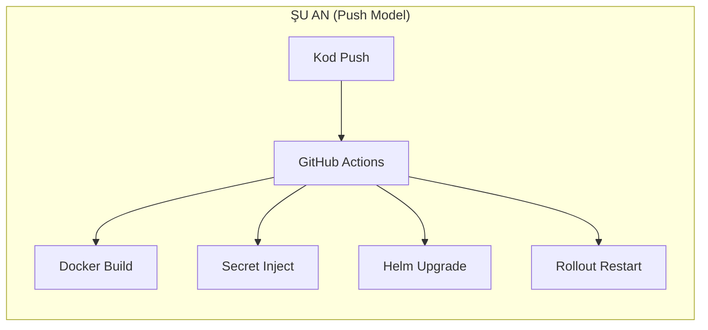
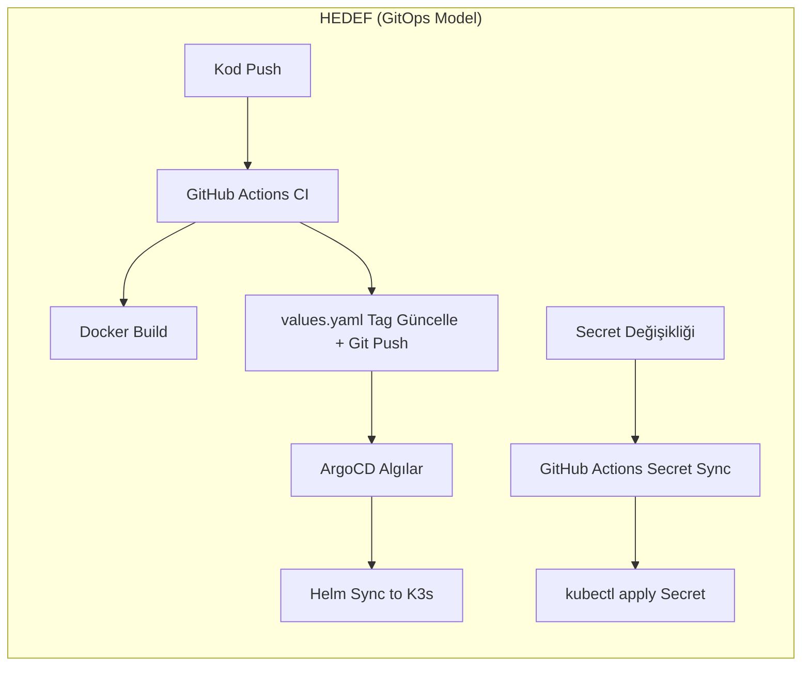

# ArgoCD GitOps Geçişi — GameGaraj

GitHub Actions'ın yalnızca **CI (Build + Tag)** yapması, Kubernetes'e deployment işleminin **ArgoCD (CD)** tarafından yönetilmesi için gerekli değişikliklerin implementasyon planı. Secret'lar **GitHub Secrets** üzerinden yönetilmeye devam eder.

---

## Mevcut Durum vs Hedef Durum





---

## User Review Required

> [!IMPORTANT]
> **NodePort Seçimi:** ArgoCD arayüzü için `30580` portunu kullanmayı planlıyorum. Bu port başka bir servis tarafından kullanılıyor mu?

> [!IMPORTANT]
> **Sonsuz Döngü Koruması:** CI workflow, `values.yaml`'daki image tag'lerini güncelleyip Git'e push edecek. Mevcut `k3s-app-deploy.yml`'deki path filtresi (`GameGaraj.Gateway/**`, `GameGaraj.Catalog.API/**` vb.) `helm/**` yolunu içermediği için bu push CI'ı tekrar tetiklemeyecektir. Ancak `k3s-config-sync.yml` `helm/**` path'ini dinliyor — bu workflow'u kaldıracağımız için sorun olmayacak. Bu davranış sizin için uygun mu?

> [!WARNING]
> **Geçiş Anı:** ArgoCD aktif edilip eski workflow'daki `Helm Upgrade` adımı kaldırılana kadar, kısa bir geçiş süreci olacak. Bu sürede birkaç dakikalık bir "hem eski hem yeni sistem aktif" durumu yaşanabilir. Bunu planlı bir bakım penceresinde yapmamız (örn. gece) önerilir.

---

## Open Questions

> [!IMPORTANT]
> **ArgoCD Kurulumu:** ArgoCD'yi K3s sunucusuna kurmak için sunucuya SSH erişimi gerekmektedir. Ancak mevcut durumda SSH key yoktur ve şifre ile bağlantı reddedilmektedir. ArgoCD kurulumu için:
> 1. Sunucuya fiziksel olarak kendiniz terminal açarak kurulum komutlarını çalıştırabilirsiniz, veya
> 2. Yeni bir GitHub Actions workflow'u (`k3s-argocd-install.yml`) hazırlayıp self-hosted runner üzerinden kurulumu yapabiliriz (önerim bu).

---

## Proposed Changes

Değişiklikler 5 aşamada uygulanacaktır.

---

### Aşama 1: ArgoCD Kurulum Workflow'u

Prometheus ve Kubernetes Dashboard kurulumlarında olduğu gibi, bir GitHub Actions workflow'u ile kurulumu gerçekleştireceğiz.

#### [NEW] [k3s-argocd-install.yml](file:///d:/Kadir/Projeler/GameGaraj/.github/workflows/k3s-argocd-install.yml)

Self-hosted runner üzerinde çalışacak `workflow_dispatch` tetiklemeli tek seferlik kurulum workflow'u:

1. **ArgoCD Namespace Oluştur:** `kubectl create namespace argocd`
2. **ArgoCD Resmi Manifestolarını Uygula:** `kubectl apply -n argocd -f https://raw.githubusercontent.com/argoproj/argo-cd/stable/manifests/install.yaml`
3. **NodePort ile Dışa Aç (30580):** `argocd-server` servisini NodePort'a patch et
4. **İlk Admin Şifresini Göster:** `argocd-initial-admin-secret`'tan şifreyi çözüp workflow summary'de göster
5. **ArgoCD Application Oluştur:** `gamegaraj` Helm chart'ını izleyen Application kaydını oluştur

---

### Aşama 2: Image Tag Stratejisi Değişikliği

Şu anda tüm imajlar `latest` tag'i ile build edilip, `rollout restart` ile yeniden yükleniyor. GitOps modelinde ArgoCD'nin değişiklikleri algılayabilmesi için her imajın **benzersiz bir tag'i** (commit SHA) olması gerekir.

#### [MODIFY] [docker-compose.build.yml](file:///d:/Kadir/Projeler/GameGaraj/docker-compose.build.yml)

İmaj tag'lerinde `${IMAGE_TAG:-latest}` environment variable desteği eklenecek:

```diff
 services:
   gateway:
-    image: gateway:latest
+    image: gateway:${IMAGE_TAG:-latest}
     build:
       context: .
       dockerfile: GameGaraj.Gateway/Dockerfile
 
   catalog-api:
-    image: catalog-api:latest
+    image: catalog-api:${IMAGE_TAG:-latest}
     build:
       context: .
       dockerfile: GameGaraj.Catalog.API/Dockerfile
```
*(Tüm 10 servis için aynı değişiklik)*

#### [MODIFY] [values.yaml](file:///d:/Kadir/Projeler/GameGaraj/helm/gamegaraj/values.yaml)

`secrets` bloğu Helm chart'tan yönetilmeyeceği için kaldırılacak. İmaj tag'leri CI tarafından güncellenecek:

```diff
 services:
   gateway:
-    image: gateway:latest
+    image: "gateway:latest"   # CI tarafından otomatik güncellenir
     nodePort: 30000
```
*(Tag formatı string olarak kalır, CI her build'de `gateway:abc1234` şeklinde günceller)*

```diff
-secrets:
-  keycloak-admin-username: ""
-  keycloak-admin-password: ""
-  ...
-  minio-secure: ""
```

---

### Aşama 3: Secret Yönetiminin Ayrılması

#### [DELETE] [secret.yaml](file:///d:/Kadir/Projeler/GameGaraj/helm/gamegaraj/templates/secret.yaml)

Bu dosya Helm chart'tan silinecek. `gamegaraj-secrets` Kubernetes Secret'ı artık Helm tarafından değil, ayrı bir workflow tarafından yönetilecek.

> [!NOTE]
> [microservice.yaml](file:///d:/Kadir/Projeler/GameGaraj/helm/gamegaraj/templates/microservice.yaml#L54-L62)'deki `secretKeyRef` referansları aynen kalacak. Deployment'lar sadece secret'ın **adını** referans eder (`gamegaraj-secrets`). Secret'ın kim tarafından oluşturulduğu önemli değildir — var olması yeterlidir.

#### [NEW] [k3s-secret-sync.yml](file:///d:/Kadir/Projeler/GameGaraj/.github/workflows/k3s-secret-sync.yml)

Mevcut `k3s-config-sync.yml`'nin sadeleştirilmiş hali. Yalnızca GitHub Secrets → Kubernetes Secret senkronizasyonu yapar:

- **Tetikleyici:** Sadece `workflow_dispatch` (manuel). Secret'lar sık değişmez.
- **Adımlar:**
  1. GitHub Secrets'ı yükle ve doğrula (mevcut mantık korunur)
  2. `kubectl create secret generic gamegaraj-secrets --from-literal=... --dry-run=client -o yaml | kubectl apply -f -` ile K8s Secret'ı oluştur/güncelle
  3. Config dosyalarını host'a kopyala (`config/` klasörü)
- **Kaldırılanlar:** `helm upgrade`, `rollout restart`, `wait for rollouts` adımlarının tamamı

#### [DELETE] [k3s-config-sync.yml](file:///d:/Kadir/Projeler/GameGaraj/.github/workflows/k3s-config-sync.yml)

Bu workflow silinecek, görevi `k3s-secret-sync.yml` ve ArgoCD tarafından devralınacak.

---

### Aşama 4: App Deploy Workflow'unun Sadeleştirilmesi

#### [MODIFY] [k3s-app-deploy.yml](file:///d:/Kadir/Projeler/GameGaraj/.github/workflows/k3s-app-deploy.yml)

Workflow'un sorumlulukları daraltılacak: **Sadece Docker image build + Git'e tag commit.**

**Korunan adımlar:**
- `Checkout Code`
- `Detect Changed Services`
- `Verify Tooling` (docker, git)
- `Build Application Images` (IMAGE_TAG ile)

**Eklenen adımlar:**
- `Update Image Tags in values.yaml`: Derlenen servislerin tag'lerini `yq` veya `sed` ile güncelleyip `[skip ci]` mesajıyla Git'e commit & push

**Kaldırılan adımlar:**
- `Ensure K3s Exists`
- `Load Bundled K3s Secrets`
- `Validate Required Secrets`
- `Ensure Namespace`
- `Sync Infrastructure Configs to Host`
- `Helm Upgrade` ← **ArgoCD devralır**
- `Restart Updated Deployments` ← **ArgoCD devralır**
- `Wait For Rollouts` ← **ArgoCD devralır**
- `Post Deploy Checks` ← **ArgoCD devralır**

**Değişen adımlar:**
- `Build Application Images`: `IMAGE_TAG=$SHORT_SHA docker compose -f docker-compose.build.yml build $SERVICES_TO_BUILD`

**Yeni akış:**
```bash
# 1. İmajları commit SHA ile build et
SHORT_SHA=$(git rev-parse --short HEAD)
IMAGE_TAG=$SHORT_SHA docker compose -f docker-compose.build.yml build $SERVICES_TO_BUILD

# 2. values.yaml'daki tag'leri güncelle (sadece derlenen servisler)
# Örn: gateway:latest → gateway:abc1234
yq -i '.services.gateway.image = "gateway:'$SHORT_SHA'"' helm/gamegaraj/values.yaml

# 3. Git'e commit & push
git config user.name "github-actions[bot]"
git config user.email "github-actions[bot]@users.noreply.github.com"
git add helm/gamegaraj/values.yaml
git commit -m "ci: update image tags to $SHORT_SHA [skip ci]"
git push

# 4. ArgoCD bu push'u algılar → otomatik sync → yeni pod'lar ayağa kalkar
```

> [!NOTE]
> `[skip ci]` commit mesajındaki bu tag, GitHub Actions'ın bu commit'ten tekrar tetiklenmesini engeller. Ek güvenlik olarak `helm/**` path filtresi de workflow'da yer almamaktadır.

---

### Aşama 5: ArgoCD Application Tanımı

ArgoCD'ye GameGaraj Helm chart'ını izlemesini söyleyen Application manifesti, kurulum workflow'u (`k3s-argocd-install.yml`) içinden oluşturulacak veya alternatif olarak repo'da saklanabilir:

#### [NEW] [helm/argocd-app/gamegaraj-app.yaml](file:///d:/Kadir/Projeler/GameGaraj/helm/argocd-app/gamegaraj-app.yaml)

```yaml
apiVersion: argoproj.io/v1alpha1
kind: Application
metadata:
  name: gamegaraj
  namespace: argocd
spec:
  project: default
  source:
    repoURL: https://github.com/kadir-yilmaz/GameGaraj.git
    targetRevision: main
    path: helm/gamegaraj
    helm:
      valueFiles:
        - values.yaml
  destination:
    server: https://kubernetes.default.svc
    namespace: default
  syncPolicy:
    automated:
      prune: true        # Git'te silinen kaynak kümeden de silinir
      selfHeal: true      # Manuel müdahaleler otomatik geri alınır
    syncOptions:
      - CreateNamespace=true
```

---

## Eklenen ve Değişen Dosyalar Özeti

| Dosya | İşlem | Açıklama |
|:---|:---|:---|
| `.github/workflows/k3s-argocd-install.yml` | **YENİ** | ArgoCD kurulum workflow'u |
| `.github/workflows/k3s-secret-sync.yml` | **YENİ** | Sadece GitHub Secrets → K8s Secret sync |
| `.github/workflows/k3s-config-sync.yml` | **SİLİNECEK** | Görevi ArgoCD + secret-sync tarafından devralınıyor |
| `.github/workflows/k3s-app-deploy.yml` | **DEĞİŞECEK** | Sadece build + tag commit. Helm/kubectl adımları kaldırılacak |
| `docker-compose.build.yml` | **DEĞİŞECEK** | `${IMAGE_TAG:-latest}` desteği |
| `helm/gamegaraj/values.yaml` | **DEĞİŞECEK** | `secrets` bloğu kaldırılacak |
| `helm/gamegaraj/templates/secret.yaml` | **SİLİNECEK** | Secret artık Helm dışında yönetilecek |
| `helm/argocd-app/gamegaraj-app.yaml` | **YENİ** | ArgoCD Application tanımı |
| `notes/argocd_kurulum_ve_giris.md` | **GÜNCELLENECEK** | Yeni mimariyi yansıtacak şekilde güncelleme |

---

## Verification Plan

### Automated Tests
- `helm template ./helm/gamegaraj` ile chart'ın secret.yaml olmadan hatasız renderlanması
- `helm lint ./helm/gamegaraj` ile lint kontrolü

### Manuel Doğrulama Adımları
1. **ArgoCD Kurulum Workflow'unu Çalıştır:** GitHub Actions üzerinden `k3s-argocd-install.yml` workflow'unu tetikle
2. **ArgoCD Arayüzüne Giriş:** `https://192.168.1.56:30580` adresinden `admin` ile giriş yap
3. **Secret Sync Workflow'unu Çalıştır:** `k3s-secret-sync.yml` workflow'unu tetikle, secret'ın K8s'te oluştuğunu doğrula
4. **Test Deploy:** Küçük bir kod değişikliği push et (örn. WebUI'da bir yorum satırı ekle)
   - CI'ın imajı build edip `values.yaml`'daki tag'i güncellediğini kontrol et
   - ArgoCD'nin değişikliği algılayıp pod'ları güncellediğini arayüzden izle
5. **Rollback Testi:** ArgoCD arayüzünden `History and Rollback` ile önceki sürüme dön, pod'ların eski tag'e döndüğünü doğrula
