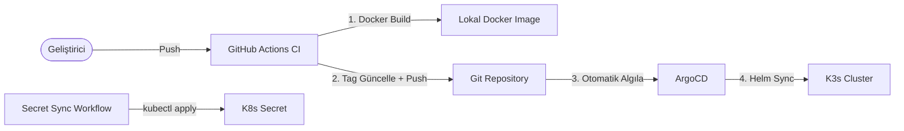

# ArgoCD GitOps Kurulum ve Kullanım Kılavuzu

Bu döküman, GameGaraj projesinin GitOps (Continuous Delivery) süreçlerini yönetmek amacıyla **ArgoCD**'nin K3s kümesine kurulması, CI/CD akışının yeniden yapılandırılması ve kullanım adımlarını içermektedir.

---

## 1. Yeni CI/CD Mimarisi

Eski model (Push):
```
Kod Push → GitHub Actions → Docker Build → Secret Inject → Helm Upgrade → Rollout Restart
```

Yeni model (GitOps):
```
Kod Push → GitHub Actions (CI) → Docker Build → values.yaml Tag Güncelle → Git Push
                                                                              ↓
                                                                   ArgoCD (CD) Algılar
                                                                              ↓
                                                                   Helm Sync → K3s Deploy
```



---

## 2. GitHub Actions Workflow'ları (Yeni Yapı)

| Workflow | Tetikleyici | Görevi |
|:---|:---|:---|
| `k3s-app-deploy.yml` | Push (kod değişikliği) / Manuel | Docker image build + `values.yaml` tag güncelle + Git push |
| `k3s-secret-sync.yml` | Sadece Manuel | GitHub Secrets → K8s Secret senkronizasyonu |
| `k3s-argocd-install.yml` | Sadece Manuel (tek seferlik) | ArgoCD kurulumu + NodePort + Application tanımı |
| `k3s-dashboard-install.yml` | Sadece Manuel (tek seferlik) | Kubernetes Dashboard kurulumu (değişmedi) |

### Silinen Workflow:
- ~~`k3s-config-sync.yml`~~ — Görevi ArgoCD + `k3s-secret-sync.yml` tarafından devralındı.

---

## 3. Kurulum Adımları (Sıralı)

### Adım 1: Değişiklikleri Push Et
Tüm kod değişiklikleri (workflow dosyaları, values.yaml, secret.yaml silme vb.) commit'lenip `main` branch'ine push edilmelidir.

### Adım 2: Secret Sync Workflow'unu Çalıştır
GitHub Actions → `K3s Secret Sync` → **Run workflow** butonuna bas.
Bu, `gamegaraj-secrets` Kubernetes Secret'ını kubectl ile oluşturur/günceller.

### Adım 3: ArgoCD Install Workflow'unu Çalıştır
GitHub Actions → `K3s ArgoCD Install` → **Run workflow** butonuna bas.
Varsayılan ayarlar:
- **NodePort:** `30580`
- **Server IP:** `192.168.1.56`
- **Version:** `stable`
- **Setup Application:** `true`

### Adım 4: ArgoCD Arayüzüne Giriş
1. Tarayıcıdan `https://192.168.1.56:30580` adresine git (sertifika uyarısını geç).
2. **Username:** `admin`
3. **Password:** Workflow çıktısında gösterilen şifreyi kullan.
4. İlk girişten sonra şifreyi değiştir.

### Adım 5: İlk Deploy'u Test Et
Herhangi bir servisin kodunda küçük bir değişiklik yap ve push et:
1. GitHub Actions imajı build eder ve `values.yaml`'daki tag'i günceller.
2. ArgoCD değişikliği algılar ve otomatik deploy eder.
3. ArgoCD arayüzünde tüm pod'ların yeşil (Healthy + Synced) olduğunu doğrula.

---

## 4. Secret Yönetimi

Secret'lar **GitHub Repository Secrets** üzerinde saklanır ve `k3s-secret-sync.yml` workflow'u ile K8s Secret'ına aktarılır.

### Secret Güncelleme Akışı:
1. GitHub Repository → Settings → Secrets and variables → Actions
2. İlgili secret değerini güncelle
3. GitHub Actions → `K3s Secret Sync` → **Run workflow**
4. İlgili pod'ları yeniden başlat (gerekirse): `kubectl rollout restart deployment/<servis-adı>`

> **Not:** ArgoCD, secret'lara dokunmaz. Secret'lar Helm chart dışında yönetilir.

---

## 5. Günlük Kullanım Senaryoları

### A. Yeni Kod Deploy Etme
1. Kodu değiştir ve `main`'e push et.
2. GitHub Actions otomatik tetiklenir → imajları build eder → tag'leri günceller.
3. ArgoCD otomatik sync yapar. **Elle müdahale gerekmez.**

### B. Rollback (Geri Alma)
1. ArgoCD UI → `gamegaraj` uygulaması → **History and Rollback**
2. İstediğiniz önceki sürümü seçin → **Rollback**
3. Podlar saniyeler içinde eski sürüme döner.

### C. Helm Chart Değişikliği (values.yaml, monitoring.yaml vb.)
1. Helm dosyasını düzenle ve `main`'e push et.
2. ArgoCD değişikliği algılayıp otomatik uygular.
3. **Artık `k3s-config-sync.yml` çalıştırmaya gerek yok.**

### D. Secret Değişikliği
1. GitHub Secrets'ta değeri güncelle.
2. `k3s-secret-sync.yml` workflow'unu manuel çalıştır.

---

## 6. ArgoCD Senkronizasyon Mekanizması (Ne Zaman Algılar?)

ArgoCD üç farklı katmanda izleme yapar:

### A. Git Deposu İzleme (Polling — Varsayılan)
ArgoCD, bağlı olduğu Git deposunu varsayılan olarak **her 3 dakikada bir** (180 saniye) tarar. CI workflow'u `values.yaml`'daki image tag'ini güncelleyip push ettikten sonra, **en geç 3 dakika** içinde ArgoCD bu değişikliği algılar ve otomatik senkronizasyonu başlatır.

Bu süre `argocd-cm` ConfigMap'indeki `timeout.reconciliation` parametresi ile değiştirilebilir:
```bash
# Polling süresini 1 dakikaya düşürme örneği
kubectl -n argocd patch configmap argocd-cm --type merge \
  -p '{"data":{"timeout.reconciliation":"60s"}}'
```

### B. GitHub Webhook ile Anında Bildirim (Opsiyonel)
3 dakika beklemek istemiyorsanız, GitHub'da bir **webhook** tanımlayabilirsiniz. Bu durumda push anında GitHub, ArgoCD'ye "yeni commit var" diye HTTP isteği gönderir ve algılama **saniyeler** içinde gerçekleşir.

**Webhook Kurulumu:**
1. GitHub Repository → Settings → Webhooks → Add webhook
2. **Payload URL:** `https://192.168.1.56:30580/api/webhook`
3. **Content type:** `application/json`
4. **Events:** `Just the push event`

> **Not:** Webhook opsiyoneldir. Yapılandırılmasa bile ArgoCD 3 dakikada bir kontrol etmeye devam eder. Webhook sadece hızı artırır, zorunlu değildir.

### C. Kubernetes Cluster İzleme (Gerçek Zamanlı)
ArgoCD ayrıca K3s kümesindeki kaynakları **Kubernetes Watch API** ile **sürekli ve gerçek zamanlı** olarak izler. Bu izleme için polling yoktur — Kubernetes event stream'i dinlenir.

- Birisi sunucuya girip `kubectl edit deployment/gateway` ile bir değişiklik yaparsa, ArgoCD bunu **anında** (saniyeler içinde) tespit eder.
- `selfHeal: true` ayarı aktif olduğu için ArgoCD, Git'teki orijinal tanıma geri döndürür (otomatik düzeltme).
- ArgoCD UI'da etkilenen kaynağın yanında sarı **OutOfSync** ikonu belirir, ardından otomatik sync ile yeşile döner.

### Özet Tablo:

| İzleme Katmanı | Ne İzler? | Kontrol Sıklığı | Sonuç |
|:---|:---|:---|:---|
| **Git Polling** | Git deposundaki commit'ler | Her 3 dakika (varsayılan) | Yeni commit → Otomatik sync |
| **GitHub Webhook** | Push event'leri | Anında (saniyeler) | Push → Anında sync (opsiyonel) |
| **K8s Watch API** | Kümedeki canlı kaynaklar | Gerçek zamanlı (sürekli) | Manuel müdahale → selfHeal |

---

## 7. Yapılan Tüm Değişiklikler ve Gerekçeleri (Teknik Changelog)

### Eklenen Dosyalar:

#### 1. `.github/workflows/k3s-argocd-install.yml` (YENİ)
ArgoCD'yi K3s kümesine kurmak için `workflow_dispatch` ile tetiklenen tek seferlik kurulum workflow'u. Kubernetes Dashboard kurulumundaki (`k3s-dashboard-install.yml`) şablon aynı yaklaşımla yazılmıştır:
- ArgoCD namespace oluşturur
- Resmi ArgoCD manifestolarını `kubectl apply` ile uygular
- Servisin tipini NodePort'a çevirerek `30580` üzerinden HTTPS erişimi açar
- İlk admin şifresini secret'tan çözüp workflow summary'de gösterir
- Opsiyonel olarak GameGaraj ArgoCD Application kaydını oluşturur

#### 2. `.github/workflows/k3s-secret-sync.yml` (YENİ)
Eski `k3s-config-sync.yml` workflow'unun sadeleştirilmiş halidir. **Yalnızca** GitHub Secrets → Kubernetes Secret senkronizasyonu yapar:
- Mevcut `K3S_SECRETS_JSON` / `K3S_SECRETS` yükleme mantığı birebir korunmuştur
- Helm yerine `kubectl create secret generic ... --dry-run=client -o yaml | kubectl apply -f -` komutu ile secret oluşturur/günceller
- Helm upgrade, rollout restart, wait for rollouts gibi adımlar **yoktur** (bunlar artık ArgoCD'nin işi)
- Tetikleyici: Sadece `workflow_dispatch` (manuel). Secret'lar sık değişmez

#### 3. `helm/argocd-app/gamegaraj-app.yaml` (YENİ)
ArgoCD'ye "GitHub'daki `helm/gamegaraj` klasörünü izle ve K3s'e uygula" diyen Application manifesti. Referans/dokümantasyon amaçlı saklanır. Gerçek uygulama, kurulum workflow'u tarafından da oluşturulabilir.
- `syncPolicy.automated.selfHeal: true` → Birisi sunucuda elle değişiklik yaparsa ArgoCD otomatik geri alır
- `syncPolicy.automated.prune: true` → Git'ten silinen kaynak kümeden de otomatik silinir

#### 4. `notes/argocd_kurulum_ve_giris.md` (YENİ)
Bu kılavuz dökümanı.

---

### Değişen Dosyalar:

#### 5. `docker-compose.build.yml` — Image Tag Stratejisi Değişikliği

**Neden değişti?**
Eski sistemde tüm imajlar `latest` tag'i ile build ediliyordu ve yeni sürümün devreye girmesi için `kubectl rollout restart` ile pod'lar zorla yeniden başlatılıyordu. ArgoCD ise **deklaratif** çalışır: `values.yaml`'daki imaj tag'i değişmezse ArgoCD "zaten güncel" diyerek hiçbir şey yapmaz. Bu yüzden her build'e **benzersiz bir tag** (Git commit SHA) verilmesi zorunludur.

**Değişiklik:**
```diff
 services:
   gateway:
-    image: gateway:latest
+    image: gateway:${IMAGE_TAG:-latest}
     build:
       context: .
       dockerfile: GameGaraj.Gateway/Dockerfile
```
*(Tüm 10 servis için aynı değişiklik uygulandı)*

- `IMAGE_TAG` environment variable'ı verilmezse `latest` kullanılır (geriye uyumluluk)
- CI workflow'u bu değişkeni `IMAGE_TAG=abc1234` şeklinde set ederek commit SHA'lı imajlar üretir
- Örnek: `IMAGE_TAG=53deb64 docker compose -f docker-compose.build.yml build gateway` → `gateway:53deb64`

#### 6. `.github/workflows/k3s-app-deploy.yml` — CI/CD Ayrımı

**Neden değişti?**
Eski workflow **hem CI (build) hem CD (deploy)** yapıyordu. Yeni modelde deploy sorumluluğu ArgoCD'ye devredildiği için bu workflow'dan Kubernetes'e dokunan tüm adımlar çıkarıldı.

**Kaldırılan Adımlar:**
- `Ensure K3s Exists` — ArgoCD ile alakasız
- `Load Bundled K3s Secrets` — Secret'lar artık ayrı workflow'da
- `Validate Required Secrets` — Secret'lar artık ayrı workflow'da
- `Ensure Namespace` — ArgoCD Application tanımında `CreateNamespace=true` ile yönetiliyor
- `Sync Infrastructure Configs to Host` — Secret sync workflow'una taşındı
- `Helm Upgrade` — **ArgoCD devralıyor**
- `Restart Updated Deployments` — **ArgoCD devralıyor** (tag değişikliği algılanınca otomatik)
- `Wait For Rollouts` — **ArgoCD devralıyor**
- `Post Deploy Checks` — **ArgoCD arayüzünden izlenebilir**

**Eklenen Adımlar:**
1. **Build Application Images:** `IMAGE_TAG=$SHORT_SHA docker compose -f docker-compose.build.yml build`
2. **Update Image Tags in values.yaml:** Derlenen servislerin tag'lerini `sed` ile güncelleyip Git'e commit
3. **Commit and Push Tag Updates:** `[skip ci]` mesajıyla Git'e push (sonsuz döngüyü engeller)

**Yeni Akış:**
```
Kod Push → Detect Changes → Docker Build (SHA tag) → values.yaml Güncelle → Git Push → ArgoCD Algılar → Deploy
```

#### 7. `helm/gamegaraj/values.yaml` — Secrets Bloğu Kaldırıldı

**Neden değişti?**
Eski yapıda 21 adet secret değeri `values.yaml`'da boş string olarak tanımlıydı ve GitHub Actions `--values /tmp/values-secrets.yaml` ile gerçek değerleri Helm'e enjekte ediyordu. ArgoCD ise Git'teki `values.yaml`'ı doğrudan okur — bu durumda **boş** değerleri canlıya uygulayıp gerçek secret'ların üzerine yazardı.

**Kaldırılan Blok:**
```yaml
# Kaldırıldı — Artık kubectl ile yönetiliyor
secrets:
  keycloak-admin-username: ""
  keycloak-admin-password: ""
  admin-email: ""
  admin-password: ""
  google-client-id: ""
  google-client-secret: ""
  smtp-username: ""
  smtp-password: ""
  iyzico-api-key: ""
  iyzico-secret-key: ""
  rabbitmq-url: ""
  redis-connection: ""
  catalog-postgres-connection: ""
  discount-postgres-connection: ""
  order-sqlserver-connection: ""
  campaign-sqlserver-connection: ""
  minio-endpoint: ""
  minio-access-key: ""
  minio-secret-key: ""
  minio-bucket-name: ""
  minio-secure: ""
```

---

### Silinen Dosyalar:

#### 8. `helm/gamegaraj/templates/secret.yaml` — SİLİNDİ

**Neden silindi?**
Bu dosya Helm chart render edildiğinde `gamegaraj-secrets` adında bir Kubernetes Secret oluşturuyordu. ArgoCD Git'teki `values.yaml`'ı okuduğunda, secret'ların değerleri boş string olduğu için **boş bir secret oluşturulacak** ve canlıdaki gerçek secret'ların üzerine yazılacaktı.

**Çözüm:** Secret artık Helm chart dışında, `k3s-secret-sync.yml` workflow'u tarafından `kubectl create secret generic` komutu ile yönetilmektedir. Microservice deployment'ları secret'a isim ile (`gamegaraj-secrets`) referans verir — secret'ın kim tarafından oluşturulduğu önemli değildir:
```yaml
# microservice.yaml (değişmedi) — sadece secret adına referans verir
- name: RabbitMQUrl
  valueFrom:
    secretKeyRef:
      name: gamegaraj-secrets    # ← Bu secret kubectl ile oluşturuluyor
      key: rabbitmq-url
```

#### 9. `.github/workflows/k3s-config-sync.yml` — SİLİNDİ

**Neden silindi?**
Bu workflow iki iş yapıyordu:
1. Secret'ları Helm'e enjekte etmek → Artık `k3s-secret-sync.yml` yapıyor
2. Helm chart değişikliklerini uygulamak → Artık ArgoCD yapıyor

Her iki görevi de başka araçlar devraldığı için workflow'un kendisi gereksiz kaldı. Ayrıca bu workflow `helm/**` path değişikliklerinde otomatik tetikleniyordu — eğer kalsaydı, CI'ın `values.yaml`'a tag yazdığı commit'te hem ArgoCD hem de bu workflow aynı anda `helm upgrade` çalıştırıp **çakışma (conflict)** yaratacaktı.