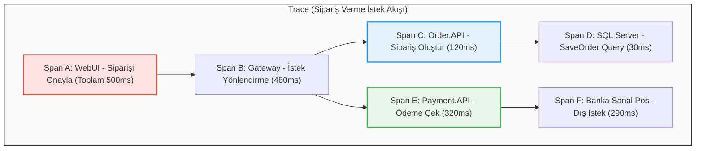

# 🎓 Distributed Tracing (Dağıtık İzleme) Masterclass - Bölüm 1: Temel Kavramlar

Kadir, gel seninle bir kahve içelim ve bu **Distributed Tracing (Dağıtık İzleme)** konusunu baştan aşağı, profesyonel bir yazılımcı gözüyle ele alalım. 

Monolitik (tek parça) bir uygulamada hata ayıklamak kolaydır. Her şey tek bir sürecin (process) içinde döner, hata aldığında stack trace'e bakar ve hangi satırda patladığını görürsün. Ama bizim şu an geliştirdiğimiz **GameGaraj** gibi mikroservis mimarilerinde işler tamamen değişir. Bir istek gelir; önce Gateway'e uğrar, oradan WebUI'a, oradan Catalog'a, oradan Basket'e gider. Arada RabbitMQ üzerinden asenkron event'ler fırlatılır, arka planda başka servisler tetiklenir.

İşte bu devasa ve karmaşık sistemde **"Bir istek atıldıktan sonra arka planda sırasıyla tam olarak ne oldu, hangi servis ne kadar bekledi ve hata nereden kaynaklandı?"** sorusunun cevabı **Distributed Tracing**'dir.

---

## 1. Temel Yapı Taşları: Trace ve Span Nedir?

Dağıtık izlemede her şey iki temel kavrama dayanır: **Trace (İz)** ve **Span (Adım/Aralık)**.

### A. Trace (İz)
Sisteme giren **bir isteğin (request) tüm yaşam döngüsüdür.** Kullanıcının "Siparişi Tamamla" butonuna basmasıyla başlar, arka plandaki tüm mikroservisleri gezip, veritabanına yazıp, ödeme çekilip kullanıcıya "Başarılı" cevabı dönene kadar geçen tüm yolculuk tek bir **Trace**'dir. Her Trace'in tüm sistemde benzersiz (benzersiz bir UUID) olan tek bir **Trace ID**'si vardır.
*   **Örnek Trace ID:** `666f7ad052b44d492f93f1...`

### B. Span (Aşama/Aralık)
Trace içindeki **tek bir iş birimidir.** Bir metodun çalışması, veritabanına atılan bir SQL sorgusu, başka bir servise atılan HTTP isteği veya RabbitMQ'ya bırakılan bir mesaj birer **Span**'dir.
*   Her span'in bir **başlangıç zamanı**, **bitiş zamanı**, **Span ID**'si ve isteğe bağlı **etiketleri (tags/attributes)** bulunur.
*   Span'ler birbirleriyle **Parent-Child (Ebeveyn-Çocuk)** ilişkisi kurarak hiyerarşik bir ağaç oluştururlar.

---

## 2. Parent-Child İlişkisi

Yukarıdaki diyagramı incelediğinde:
1.  **Span A (Parent):** WebUI'ın başlattığı ana işlem.
2.  **Span B (Child of A):** Gateway'e giden istek. Span A tamamlanmadan Span B tamamlanamaz.
3.  **Span C (Child of B):** Order.API'nin yaptığı sipariş oluşturma işlemi.
4.  **Span D (Child of C):** Order.API'nin veritabanına yazdığı SQL sorgusu.

Eğer sistemde bir hata oluşursa, örneğin **Span F (Banka Sanal Pos)** hata dönerse, bu hata yukarıya doğru propagate edilir (yayılır). Jaeger ekranında hata veren span kırmızı renkli görünür. Böylece üstteki 80 span arasından hata alan yerin banka entegrasyonu olduğunu 1 saniyede anlarsın.

---

## 3. Context Propagation (Trace'in Servisler Arasında Taşınması)

"Peki ama WebUI'daki Trace ID ile Catalog.API'deki veya RabbitMQ'daki Trace ID'nin aynı olması nasıl sağlanıyor?" 

Buna **Context Propagation (Bağlam Taşıma)** denir. Bir mikroservis diğer bir mikroservise HTTP isteği atarken veya kuyruğa mesaj yazarken, OpenTelemetry SDK'sı otomatik olarak isteğin başlığına (Header) standartlaştırılmış bir izleme bilgisi ekler. W3C standartlarına göre bu başlığın adı **`traceparent`**'tır.

### `traceparent` Başlığı Yapısı:
Bir HTTP isteğinin başlığında şu veriyi görürsün:
`traceparent: 00-4bf92f3577b34da6a3ce929d0e0e4736-00f067aa0ba902b7-01`

Bu veri 4 parçadan oluşur:
1.  **Versiyon (`00`):** Şu anki W3C standart versiyonu.
2.  **Trace ID (`4bf92f3577b34da6a3ce929d0e0e4736`):** Tüm isteklere ortak olan ana kimlik.
3.  **Parent Span ID (`00f067aa0ba902b7`):** Bu isteği atan servis tarafındaki span'in ID'si. Hedef servis bunu alıp kendi oluşturacağı span'in "Parent ID"si yapar.
4.  **Trace Flags (`01`):** Bu izin kaydedilip kaydedilmeyeceğini (sampling) belirtir (`01` = trace verisini sunucuya gönder demektir).

İstek alan servis (örneğin `Catalog.API`) gelen HTTP isteğinin başlıklarında `traceparent` değerini arar. Bulursa yeni bir trace başlatmaz, mevcut `Trace ID`'yi devralır ve kendi span'lerini onun altına ekler. **Böylece dağıtık zincir kurulmuş olur.**

---

## 4. Jaeger'ın Rolü Nedir?

Mikroservislerimiz çalışırken ürettikleri bu trace ve span bilgilerini belleklerinde tutmazlar. Her servis, oluşturduğu span'leri asenkron olarak arka planda **Jaeger**'a push eder (bizim k3s pod'larında `OTLP 4317` portuna gönderdiğimiz yapı).

Jaeger ise:
*   Tüm servislerden gelen bu bağımsız span parçalarını toplar.
*   Bunları `Trace ID` ve `Parent ID` ilişkilerine göre bir yapboz gibi birleştirir.
*   Sana o harika arayüzü sunarak hangi adımın kaç milisaniye sürdüğünü görselleştirir.

Bir sonraki bölümde, bu yapının **.NET içinde nasıl kodlandığını, `Activity` ve `ActivitySource` sınıflarının ne olduğunu** inceleyeceğiz. Kahvenden bir yudum al ve [Bölüm 2: .NET ve C# Alt Yapısı](file:///d:/Kadir/Projeler/GameGaraj/notes/observability/distributed_tracing_in_dotnet.md) dosyasına geçelim.
