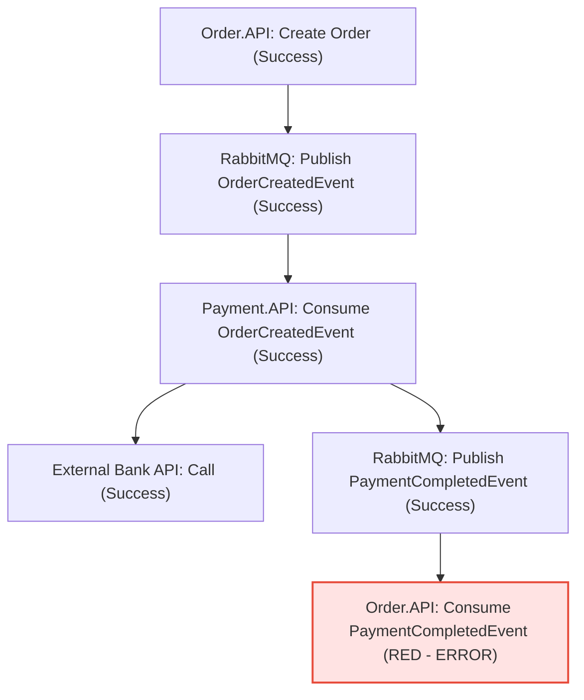

# 🎓 Distributed Tracing (Dağıtık İzleme) Masterclass - Bölüm 3: Gerçek Dünya Senaryoları ve Teşhis

Kadir, şimdiye kadar teoriyi öğrendik, .NET altyapısına baktık. Şimdi en önemli yere geldik: **Gerçek dünyada bir senior developer olarak Jaeger ekranına baktığında neyi nasıl teşhis edersin?**

Karşılaşacağın 3 klasik yazılım krizini ve bunları Jaeger ile nasıl 5 dakikada çözeceğini inceleyelim.

---

## Senaryo 1: Veritabanı "N+1 Sorgu" Felaketi (Sistem Neden Yavaş?)

**Sorun:** Vitrin (Showcase) sayfası yerel ortamda çok hızlıyken, canlıya çıktığında ve ürün sayısı arttığında aşırı yavaşlamaya başladı. Sayfa yüklenmesi 3 saniye sürüyor.

**Jaeger Teşhisi:**
Jaeger UI'ı açtın ve yavaş çalışan `GET /` trace'ine tıkladın.
*   En üstte `GameGaraj.WebUI` span'i var (3000ms).
*   Onun altında `Catalog.API` span'i var (2950ms).
*   `Catalog.API` span'inin altına indiğinde, **birbirinin aynısı yüzlerce küçük mavi veritabanı span'i** görüyorsun! Hepsi `SELECT * FROM ProductPrices WHERE ProductId = @id` sorgusunu çalıştırıyor ve her biri 5-10ms sürüyor.

```
┌────────────────────────────────────────────────────────────────────────┐
│ Catalog.API: GET api/products/showcase (2950ms)                        │
└────────────────────────────────────────────────────────────────────────┘
  ├── SQL: SELECT * FROM Products (15ms)
  ├── SQL: SELECT * FROM ProductPrices WHERE ProductId = 1 (8ms)
  ├── SQL: SELECT * FROM ProductPrices WHERE ProductId = 2 (7ms)
  ├── SQL: SELECT * FROM ProductPrices WHERE ProductId = 3 (10ms)
  ... (böyle 150 tane sorgu aşağıya doğru akıyor)
```

**Senior Teşhisi:**
"Kadir, kodda `foreach` döngüsünün içinde veritabanı sorgusu atılmış! EF Core'un Lazy Loading özelliği veya döngü içindeki `repository.GetPriceById()` çağrısı yüzünden sistem N+1 sorgu atıyor."

**Cözüm:**
Kodda `foreach` ile tek tek fiyat sorgulamak yerine, veritabanından ürünleri çekerken fiyatlarını `.Include(p => p.Prices)` kullanarak tek bir sorguda (Eager Loading) çekmek.
*   **Sonuç:** Veritabanı span sayısı 150'den 1'e iner, sayfa hızı 3 saniyeden 80ms'ye düşer!

---

## Senaryo 2: Asenkron Sipariş ve Ödeme Akışında Kopukluk (Hata Nerede?)

**Sorun:** Müşteri sipariş verdi, kredi kartından para çekildi ama sipariş "Bekliyor" durumunda kaldı, "Onaylandı" aşamasına geçmedi. Müşteri destek hattı arıyor.

**Jaeger Teşhisi:**
Müşterinin sipariş ID'sini veya Kibana loglarından bulduğun `TraceId`'yi Jaeger arama kutusuna yapıştırdın. Trace ağacını inceliyorsun:



*   `Order.API` siparişi yazmış (Yeşil).
*   `RabbitMQ` üzerinden mesaj gitmiş (Yeşil).
*   `Payment.API` ödemeyi çekmiş (Yeşil).
*   `Payment.API` kuyruğa `PaymentCompletedEvent` atmış (Yeşil).
*   En altta, `Order.API` içindeki `Consume PaymentCompletedEvent` span'i **kırmızı (Hatalı)** görünüyor.
*   Span'e tıkladın ve etiketlerine (Tags) baktın: 
    *   `error.message: NullReferenceException`
    *   `error.stacktrace: OrderController.cs: line 87`

**Senior Teşhisi:**
"Ödeme başarılı olmuş ama `Order.API` ödeme tamamlandı mesajını aldığında sipariş durumunu güncellerken veritabanında siparişi bulamamış veya null bir nesneye dokunmuş."

**Çözüm:**
Hemen `OrderController.cs` 87. satıra gidip ilgili hatayı düzeltirsin. Jaeger olmasaydı loglar arasında kaybolup hatanın ödemede mi, bankada mı yoksa veritabanında mı olduğunu anlamak saatler sürecekti.

---

## Senaryo 3: Dış Entegrasyon (3rd Party API) Yavaşlığı

**Sorun:** Sepeti onaylama ekranı bazen çok yavaş açılıyor.

**Jaeger Teşhisi:**
Jaeger'da ilgili trace'i açtın. Toplam süre 5.2 saniye sürüyormuş. 
Ağaçta aşağı doğru indin ve şunu gördün:
*   `Payment.API` ➔ `IYzico API` HTTP çağrısı tek başına **5010ms** sürmüş.
*   Sizin veritabanı sorgularınız ve servis içi kodlarınız ise sadece **40ms** sürmüş.

**Senior Teşhisi:**
"Yavaşlık bizim sunucularda veya kodumuzda değil. Çalıştığımız ödeme firmasının (Iyzico, Stripe vb.) API'leri geç cevap veriyor."

**Çözüm:**
Ödeme servisimize uygun bir **Timeout (Zaman aşımı)** ve **Retry Policy (Polly ile yeniden deneme)** ekleriz. Ayrıca kullanıcıya boş yere 5 saniye bekletmek yerine "Ödeme sağlayıcı geç yanıt veriyor, lütfen tekrar deneyin" gibi kontrollü bir hata döneriz.

---

## 💡 Trace Kullanırken Dikkat Edilmesi Gereken Altın Kurallar (Production Best Practices)

1.  **Hassas Verileri Gizle (No Sensitive Data):** Span etiketlerine (tags) asla şifre, kredi kartı numarası, TC Kimlik no veya kişisel verileri (KVKK) yazma. Jaeger verileri genelde şifrelenmeden saklanır.
2.  **Düşük Varyasyonlu (Low Cardinality) Etiketler Kullan:** Tag olarak eklediğin anahtarların değerleri çok sık değişen şeyler olmamalıdır. Örneğin SQL sorgusunun kendisini tag olarak eklemek iyidir ama her sorgunun içine dinamik parametreleri gömmek Elasticsearch/Jaeger veri tabanını şişirir. Parametrik sorgular tercih edilmelidir (`Id = @id` gibi).
3.  **Trace ID'yi Loglara Yaz:** Serilog ile Elasticsearch'e log yazarken trace kimliğini de log satırına ekle (zaten projemizde bunu yaptık). Bir hata logu gördüğünde, hemen o logdaki `TraceId`'yi alıp Jaeger'a giderek hatanın tüm geçmişini izleyebilmelisin.

Kadir, dağıtık izleme mantığını teorik, kodsal ve pratik olarak baştan sona inceledik. Bu üç dosyayı (`distributed_tracing_guide.md`, `distributed_tracing_in_dotnet.md`, `distributed_tracing_real_world.md`) observability notlarının altına kalıcı birer kılavuz olarak bıraktım. Takıldığın her an açıp referans alabilirsin! 🚀
