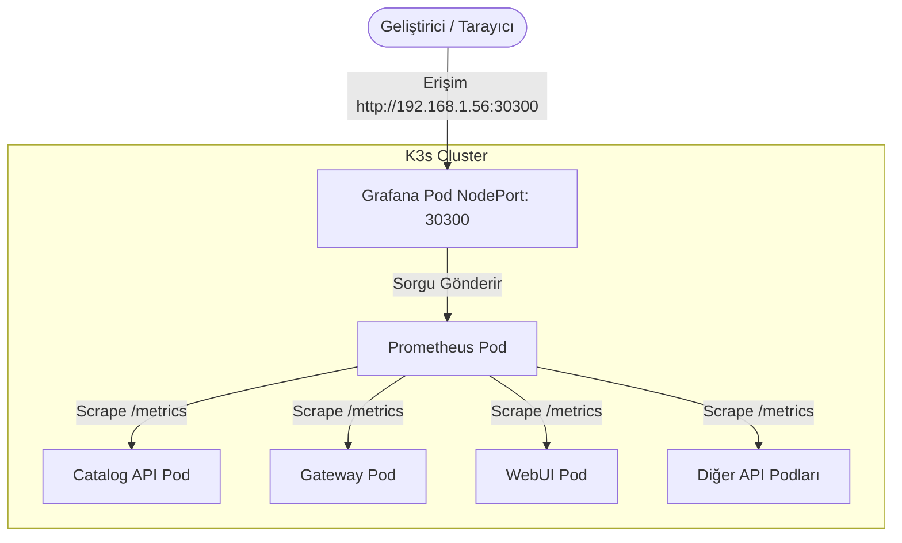

# Prometheus ve Grafana K3s Kurulum Notları

Bu döküman, GameGaraj projesine Prometheus ve Grafana izleme (monitoring) altyapısının K3s (Kubernetes) kümesi içine kurulması için gerekli adımları içermektedir.

---

## 1. Mimari ve Çalışma Mantığı

K3s kümesi içinde Prometheus ve Grafana'nın en verimli ve hafif (lightweight) şekilde çalışması için **Kubernetes Service Discovery (Servis Keşfi)** mekanizmasını kullanacağız:



1. **Mikroservisler**: `prometheus-net.AspNetCore` paketi ile `/metrics` endpoint'ini açar. Kubernetes pod tanımlarına ekleyeceğimiz `prometheus.io/scrape: "true"` etiketi sayesinde Prometheus bu servisleri otomatik tanır.
2. **Prometheus**: Kubernetes API'si ile haberleşerek aktif podları listeler, etiketleri okur ve otomatik olarak `/metrics` adreslerinden veri toplar.
3. **Grafana**: Prometheus'u varsayılan veri kaynağı (Data Source) olarak kullanır ve verileri grafiklere döker.

---

## 2. Planlanan Değişiklikler ve Görev Tanımları

### Görev 1: Mikroservis Ortak Kütüphanesine (Shared) Prometheus Eklenmesi
* `GameGaraj.Shared.csproj` dosyasına `prometheus-net.AspNetCore` paketi eklenecek.
* `GameGaraj.Shared/Logging/SerilogRequestLoggingExtensions.cs` (veya yeni bir extension sınıfı) güncellenerek:
  - `app.UseHttpMetrics()` (HTTP metriklerini toplamak için)
  - `app.MapMetrics()` (Prometheus'un verileri çekeceği `/metrics` adresini açmak için) eklenecek.
* Böylece tek bir ortak kütüphane değişikliğiyle tüm API ve Gateway projeleri metrik sunmaya başlayacak.

### Görev 2: Helm Şablonuna Pod Etiketlerinin (Annotations) Eklenmesi
* `helm/gamegaraj/templates/microservice.yaml` altındaki pod şablonuna (`spec.template.metadata.annotations`) şu etiketler eklenecek:
  - `prometheus.io/scrape: "true"` (Prometheus'un bu podu dinlemesini söyler)
  - `prometheus.io/port: "8080"` (Metriklerin çekileceği iç port)
  - `prometheus.io/path: "/metrics"` (Metrik endpoint yolu)

### Görev 3: K3s İçin Prometheus ve Grafana YAML Şablonlarının Oluşturulması
* `helm/gamegaraj/templates/monitoring.yaml` adında yeni bir dosya oluşturulacak. Bu dosya şunları içerecek:
  1. **RBAC Rolleri**: Prometheus'un Kubernetes API'sini sorgulayıp pod IP'lerini öğrenebilmesi için okuma izni veren `ServiceAccount`, `ClusterRole` ve `ClusterRoleBinding` tanımları.
  2. **Prometheus ConfigMap**: Kubernetes podlarını dinamik tarayan `prometheus.yml` konfigürasyonunu barındıracak.
  3. **Prometheus Deployment & Service**: Prometheus podunu ve iç servis tanımını içerecek.
  4. **Grafana Datasource Provisioning ConfigMap**: Grafana açıldığında Prometheus veri kaynağının el ile kurulmasına gerek kalmadan otomatik tanımlı gelmesini sağlayacak.
  5. **Grafana Deployment & Service**: Grafana podunu ayağa kaldıracak ve dışarıdan `http://192.168.1.56:30300` adresinden erişilebilmesi için bir **NodePort (30300)** servisi tanımlayacak.

### Görev 4: Helm values.yaml Güncellemesi
* `helm/gamegaraj/values.yaml` dosyasına izleme altyapısını açıp kapatabilmek için `monitoring` konfigürasyon bloğu eklenecek:
  ```yaml
  monitoring:
    enabled: true
    prometheus:
      image: "prom/prometheus:v2.51.0"
      replicaCount: 1
    grafana:
      image: "grafana/grafana:10.4.1"
      replicaCount: 1
      nodePort: 30300
  ```

---

## 3. Eklenen ve Değişen Dosyalar Listesi

### Eklenen Dosyalar:
1. **`helm/gamegaraj/templates/monitoring.yaml`** (K3s için Prometheus, Grafana, ConfigMap'ler ve RBAC izinleri)
2. **`notes/prometheus_grafana_kurulumu.md`** (Bu kılavuz dökümanı)

### Değişen Dosyalar:
1. **`GameGaraj.Shared/GameGaraj.Shared.csproj`** (Prometheus NuGet paket bağımlılığı eklendi)
2. **`GameGaraj.Shared/Logging/SerilogRequestLoggingExtensions.cs`** (Metrics middleware ve endpoint yönlendirmeleri eklendi)
3. **`helm/gamegaraj/templates/microservice.yaml`** (Mikroservis pod tanımlarına otomatik metrik toplama etiketleri eklendi)
4. **`helm/gamegaraj/values.yaml`** (Prometheus & Grafana için enable/disable ve port parametreleri eklendi)

---

## 4. Doğrulama ve Kullanım Adımları

1. Kodlar commitleyip pushlandıktan sonra GitHub Actions pipeline'ı çalışacak ve k3s uygulamayı güncelleyecek.
2. Tarayıcıdan `http://192.168.1.56:30300` adresine girilerek Grafana arayüzü açılacak (Varsayılan giriş: admin/admin).
3. Sol menüden **Connections > Data Sources** sekmesine girilerek **Prometheus** veri kaynağının otomatik olarak yeşil (başarılı) şekilde bağlı olduğu doğrulanacak.
4. Grafana'da **Dashboards > New > Import** kısmına tıklanıp `.NET` metriklerini izlemek için popüler olan **10427** dashboard ID'si girilerek hazır dashboard sisteme yüklenecek.

---

## 5. Grafikleri Okuma ve Anlama Kılavuzu (Giriş Seviyesi)

Grafana arayüzündeki paneller, .NET mikroservislerinizin durumunu izlemek için şu anlamlara gelir:

### A. The duration of HTTP requests (HTTP İstek Süreleri) ⏱️
- **Anlamı:** Kullanıcıların veya servislerin attığı isteklerin ne kadar sürede yanıtlandığını milisaniye cinsinden gösterir.
- **Yorumlama:** 
  - `0 - 200ms` arası: Mükemmel, sistem çok hızlı.
  - `> 2.0s` (2 saniye üstü): Sistemde yavaşlayan veritabanı sorguları veya kilitlenen harici API istekleri var demektir.

### B. Requests currently in progress (Aktif İşlenen İstekler) 🚦
- **Anlamı:** Tam şu saniyede, sunucu üzerinde işlem gören (yanıtı henüz tamamlanmamış) anlık istek sayısıdır.
- **Yorumlama:**
  - Normal durumlarda `0` veya çok düşük olmalıdır.
  - Eğer bu sayı sürekli yüksek kalıyorsa, isteklerin kilitlendiği veya sunucunun aşırı yük altında ezildiği anlamına gelir.

### C. Start time of the process (Uygulama Başlama Süresi) 🚀
- **Anlamı:** Uygulamanın en son ne zaman sıfırdan başlatıldığını gösterir.
- **Yorumlama:**
  - Eğer bu süre çok yakın bir tarihi gösteriyorsa, uygulamanız arka planda çökmüş (Crash olmuş) ve Kubernetes (K3s) onu otomatik olarak yeniden ayağa kaldırmış demektir.

### D. Total known allocated memory (Tahsis Edilen RAM) 💾
- **Anlamı:** .NET Runtime'ın o an kontrol ettiği toplam bellek miktarıdır (Megabayt cinsinden).
- **Yorumlama:**
  - Zaman içinde grafik dalgalanmalıdır (RAM artar, Garbage Collector temizleyince düşer).
  - Grafik sürekli yükseliyor ve hiç düşmüyorsa uygulamada **Memory Leak (Bellek Sızıntısı)** vardır.

### E. GC collection count (Çöp Toplayıcı Çalışması) 🧹
- **Anlamı:** .NET'in bellek temizleme mekanizmasının (Garbage Collector) çalışma sıklığıdır.
- **Yorumlama:**
  - `Gen 0` ve `Gen 1` sık çalışabilir.
  - `Gen 2` (en ağır temizlik) çizgisi çok sık tetikleniyorsa, kod içinde gereksiz yere çok fazla büyük nesne üretilip atılıyor demektir, bu da performansı düşürür.

### F. Total number of threads (İşçi Sayısı) 👥
- **Anlamı:** Uygulamanın işlemci üzerinde paralel iş yapabilmek için açtığı işçi (Thread) sayısıdır.
- **Yorumlama:**
  - Kontrolsüz şekilde sürekli yukarı doğru tırmanıyorsa, kodda asenkron işlemlerde kilitlenmeler yaşanıyor (Thread Leak) olabilir.

### G. Process working set (Fiziksel RAM Tüketimi) 🖥️
- **Anlamı:** Konteynerin sunucu üzerinde fiziksel olarak tükettiği toplam gerçek RAM miktarıdır.
- **Yorumlama:**
  - Helm üzerinde belirlediğiniz RAM sınırlarına (Limits) yaklaştığında pod'un **OOMKilled** (Out Of Memory) hatası alarak çökeceğini haber verir.
