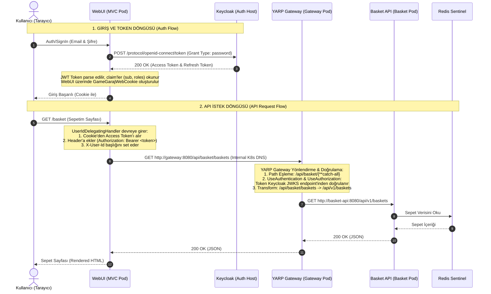

# GameGaraj İstek ve Kimlik Doğrulama İşleyişi (Request Flow & Auth Architecture)

Bu doküman, GameGaraj mikroservis mimarisindeki bir kullanıcının WebUI üzerindeki eylemlerinden, Keycloak kimlik doğrulamasına, YARP API Gateway yönlendirmesine ve backend mikroservislerine uzanan tüm istek döngüsünü açıklamaktadır.

---

## 1. Genel Mimari ve İstek Akış Diyagramı (Mermaid)

Aşağıdaki diyagramda bir kullanıcının sepet sayfasına gitmesi veya sepeti listelemesi senaryosundaki istek akışı ve kimlik doğrulama adımları gösterilmiştir:

---

## 2. Detaylı İstek Adımları (Adım Adım Açıklama)

### Aşama A: Kullanıcı Giriş İşlemi (Authentication / Sign-In)
1. **İstek Başlatma:** Kullanıcı tarayıcıdan giriş yapmak istediğinde, WebUI'daki `SignIn` formunu doldurur.
2. **Keycloak POST İsteği:** WebUI sunucu tarafında (`IdentityService.cs`), Keycloak'un token alma endpoint'ine (`/protocol/openid-connect/token`) arkadan (Server-to-Server) bir POST isteği gönderir:
   - **Client ID:** `web-ui`
   - **Grant Type:** `password`
   - **Credentials:** Kullanıcının girmiş olduğu E-posta (`username`) ve Şifre (`password`).
3. **Token Yanıtı:** Keycloak kimlik bilgilerini doğrularsa, WebUI'a şifrelenmiş bir JWT **Access Token** ve **Refresh Token** döner.
4. **Cookie Oluşturma:** WebUI, gelen Access Token'ı çözümler (parse eder):
   - JWT içindeki `sub` claim'ini kullanıcının benzersiz ID'si (`NameIdentifier`) olarak belirler.
   - `realm_access.roles` içindeki rolleri (örn. `admin`, `instructor`) MVC yetkilendirme mekanizmasına enjekte eder.
   - Tarayıcıya `GameGarajWebCookie` adında şifrelenmiş bir oturum cookie'si yazar ve token'ları bu cookie'nin içinde saklar (`SaveTokens = true`).

---

### Aşama B: WebUI'dan API Gateway'e İstek Gönderme
1. **HTTP Client Çağrısı:** Kullanıcı sepete ekleme, ürün arama veya sipariş verme gibi bir eylem yaptığında, WebUI backend'den veri çekmek için kendi servislerini çağırır (örn. `BasketService.cs`).
2. **Delege Edici Handler (Interceptors):** WebUI Http client'ları oluşturulurken devreye [UserIdDelegatingHandler](file:///d:/Kadir/Projeler/GameGaraj/GameGaraj.WebUI/Handlers/UserIdDelegatingHandler.cs) girer. Bu handler:
   - O anki HTTP oturumunun cookie'sinden **Access Token**'ı alır.
   - İstek başlığına (Headers) `Authorization: Bearer <Access_Token>` değerini ekler.
   - Ayrıca kullanıcının Keycloak `sub` ID'sini `X-User-Id` başlığı ile ekler.
3. **Gateway'e Gönderim:** İstek, K3s içindeki API Gateway servis IP'sine/DNS adına gönderilir. Örneğin:
   `GET http://gateway:8080/api/basket/baskets`

---

### Aşama C: YARP API Gateway İşlemleri (Yönlendirme ve Doğrulama)
Gateway podunda (`GameGaraj.Gateway`), istek karşılandığında sırasıyla şu ASP.NET Core middleware'leri çalıştırılır:

1. **Routing (`UseRouting`):** İstek path'ine göre YARP üzerindeki rotalar eşleştirilir.
   - İstek `/api/basket/baskets` ise, [appsettings.json](file:///d:/Kadir/Projeler/GameGaraj/GameGaraj.Gateway/appsettings.json) içerisindeki `basket-route` eşleşir.
   - Bu rota `basket-cluster` kümesine bağlıdır.
2. **Kimlik Doğrulama & Yetkilendirme (`UseAuthentication` & `UseAuthorization`):**
   - Rota eğer bir yetki veya kimlik doğrulama politikası içeriyorsa (Gateway JWT doğrulaması), Gateway gelen Bearer token'ı doğrular.
   - Doğrulama işlemi için Gateway Keycloak'un public imza anahtarlarını (JWKS) kullanır (K8s içinden `IdentityOption.Address` yani `http://192.168.1.56:8080/realms/GameGaraj` adresine sorgu atılır).
3. **Yönlendirme ve Path Dönüşümü (Transforms):**
   - YARP rotadaki kurala göre URL'i dönüştürür.
   - Örneğin `basket-route` için transform kuralı şudur: `/api/basket/{**catch-all}` -> `/api/v1/{**catch-all}`.
   - URL `/api/basket/baskets` iken `/api/v1/baskets` haline gelir.
4. **Backend Servise Proxy Etme (`MapReverseProxy`):**
   - Gateway, hedef cluster adresini okur. `basket-cluster` için adresi Kubernetes DNS çözümü ile `http://basket-api:8080` olarak bulur.
   - Yeni dönüştürülmüş URL ile isteği doğrudan hedef pod'a yönlendirir:
     `GET http://basket-api:8080/api/v1/baskets`

---

### Aşama D: Backend Mikroservis ve Veritabanı Süreci
1. **İstek Karşılama:** `basket-api` servisi isteği alır, isteğin header'ındaki `X-User-Id` değerine göre kullanıcının sepetini veri tabanından (Redis Sentinel) sorgular.
2. **Cevap Dönüşü:** Veri tabanından dönen sepet nesnesini JSON formatında Gateway'e iletir.
3. **Gateway'den WebUI'a İletim:** Gateway bu cevabı şeffaf bir şekilde WebUI'a aktarır.
4. **WebUI HTML Rendering:** WebUI gelen JSON verisini alıp HTML şablonuna (Razor View) bağlayarak kullanıcı tarayıcısına nihai HTML sayfasını döner.

---

## 3. Servislerin Gateway Üzerindeki Path ve Cluster Haritası

Gateway'in hangi istekleri hangi servis DNS'ine yönlendirdiği aşağıdaki tabloda özetlenmiştir:

| Dış İstek Path'i (WebUI veya Mobil) | Eşleşen Rota | Dönüştürülmüş Hedef Path | Hedef Cluster K8s Adresi | Servisin Kullandığı Altyapı |
|---|---|---|---|---|
| `/api/catalog/{**catch-all}` | `catalog-route` | `/api/{**catch-all}` | `http://catalog-api:8080` | PostgreSQL & Elasticsearch |
| `/api/basket/{**catch-all}` | `basket-route` | `/api/v1/{**catch-all}` | `http://basket-api:8080` | Redis Sentinel |
| `/api/favorites/{**catch-all}`| `favorites-route`| `/api/v1/favorites/{**catch-all}`| `http://basket-api:8080` | Redis Sentinel |
| `/api/order/{**catch-all}` | `order-route` | `/api/{**catch-all}` | `http://order-api:8080` | MS SQL Server |
| `/api/payment/{**catch-all}` | `payment-route` | `/api/payments/{**catch-all}` | `http://payment-api:8080` | Iyzico API |
| `/api/photostock/{**catch-all}`| `photostock-route`| `/api/{**catch-all}` | `http://photostock-api:8080` | MinIO Obje Deposu |
| `/api/campaign/{**catch-all}` | `campaign-route`| `/api/{**catch-all}` | `http://campaign-api:8080` | MS SQL Server |
| `/api/discount/{**catch-all}` | `discount-route`| `/api/{**catch-all}` | `http://discount-api:8080` | PostgreSQL |

---

## 4. Asenkron Mesajlaşma Akışı (MassTransit & RabbitMQ)

Senkron HTTP isteklerinin haricinde, servisler arasında **gevşek bağlı (loosely coupled)** iletişimi sağlamak için MassTransit ve RabbitMQ kullanılır:

- **Örnek Senaryo (Sipariş Tamamlama):**
  1. Kullanıcı sepeti onaylar, `order-api` veritabanına siparişi yazar.
  2. `order-api` siparişin alındığına dair bir `OrderCreatedEvent` mesajını RabbitMQ (`192.168.1.56`) kuyruğuna yayınlar (Publish).
  3. `invoice-api` ve `basket-api` bu kuyruğu dinlemektedir.
  4. Mesaj geldiğinde:
     - `basket-api` kullanıcının sepetini temizler (Redis'ten siler).
     - `invoice-api` müşteriye SMTP üzerinden e-posta faturası gönderir.
  5. Bu işlemler arka planda asenkron olarak gerçekleştiği için kullanıcı siparişin tamamlanması için faturanın oluşturulmasını ve gönderilmesini beklemek zorunda kalmaz.
